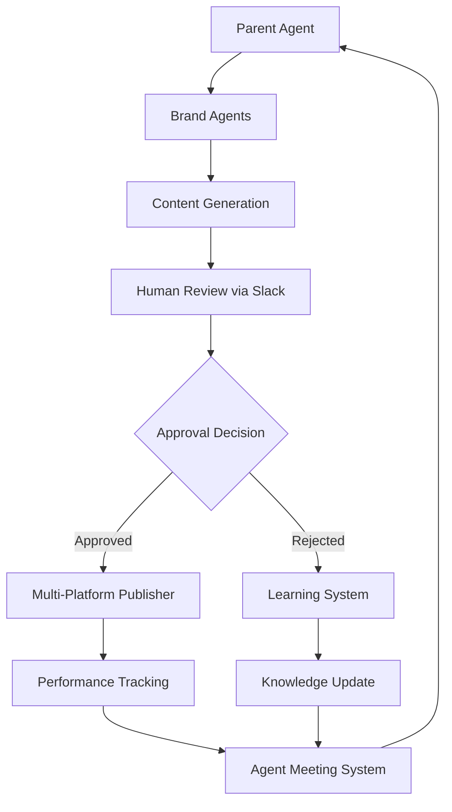

# Product Requirements Document (PRD)
# Multi-Agent Social Media Management System

**Document Version:** 1.0  
**Date:** January 2024  
**Product:** AI-Powered Multi-Agent Social Media Management Platform  
**Platform:** n8n Workflow Automation  

---

## 1. Executive Summary

### 1.1 Product Vision
Create an autonomous, AI-powered social media management ecosystem where specialized agents collaborate to produce, review, and distribute brand-specific content across multiple platforms while continuously learning from human feedback and performance metrics.

### 1.2 Product Objectives
- **Autonomy**: Reduce manual content creation effort by 80%
- **Quality**: Maintain brand consistency across all platforms
- **Learning**: Improve content performance through AI feedback loops
- **Scale**: Manage 5+ brands simultaneously with minimal human oversight
- **Collaboration**: Enable seamless human-AI and AI-AI interactions

### 1.3 Success Metrics
- **Content Volume**: 50+ posts per brand per week
- **Approval Rate**: >85% first-pass content approval
- **Engagement**: 20% improvement in average engagement rates
- **Efficiency**: 90% reduction in content creation time
- **Learning Velocity**: Weekly improvement in content quality scores

---

## 2. User Personas and Use Cases

### 2.1 Primary Users

#### **Marketing Manager** (Primary Stakeholder)
- **Goals**: Oversee brand consistency, approve content strategy, monitor performance
- **Pain Points**: Time-consuming content review, maintaining voice across brands
- **Interaction**: Slack-based content approval, weekly strategy reviews

#### **Content Creator** (Human Collaborator)
- **Goals**: Provide feedback on AI-generated content, guide creative direction
- **Pain Points**: Repetitive content creation, brand voice alignment
- **Interaction**: Real-time feedback through Slack, content refinement requests

#### **Brand Manager** (Brand Guardian)
- **Goals**: Ensure brand voice consistency, monitor brand-specific metrics
- **Pain Points**: Cross-platform brand management, content quality control
- **Interaction**: Brand-specific performance dashboards, approval workflows

### 2.2 AI Agent Personas

#### **Parent Social Media Manager** (Orchestrator Agent)
- **Role**: Strategic coordinator and task delegator
- **Personality**: Analytical, strategic, performance-focused
- **Responsibilities**: Trend analysis, task delegation, performance monitoring
- **Decision Making**: Data-driven priority setting, resource allocation

#### **Brand-Specific Content Agents**
Each agent has distinct personality traits aligned with brand identity:

**Humanity Rocks Agent**
- **Personality**: Compassionate, inspiring, community-focused
- **Voice**: Warm, encouraging, authentic
- **Content Focus**: Human stories, community impact, social good
- **Tone**: Uplifting and motivational

**MyReflection Agent**
- **Personality**: Thoughtful, introspective, wise
- **Voice**: Gentle, contemplative, supportive
- **Content Focus**: Personal growth, mindfulness, self-reflection
- **Tone**: Calming and insightful

**FT-News Agent**
- **Personality**: Professional, analytical, authoritative
- **Voice**: Informative, credible, data-driven
- **Content Focus**: Technology trends, business analysis, market insights
- **Tone**: Professional and informative

**Teaching Mom AI Agent**
- **Personality**: Patient, educational, approachable
- **Voice**: Friendly, clear, reassuring
- **Content Focus**: AI education, family technology, practical guidance
- **Tone**: Nurturing and educational

**Infinite-Ideas Agent**
- **Personality**: Creative, innovative, energetic
- **Voice**: Imaginative, bold, inspiring
- **Content Focus**: Creative thinking, innovation, breakthrough ideas
- **Tone**: Energetic and inspiring

---

## 3. Functional Requirements

### 3.1 Core Workflow Specifications

#### **3.1.1 Parent Social Media Manager Workflow**

**Trigger Mechanism:**
- Schedule: Every 2 hours (12 executions/day)
- Manual: On-demand strategy updates
- Event-driven: Performance threshold alerts

**Agent Behavior:**
```
1. Environmental Analysis
   ├── Scan trending topics (Twitter API, Google Trends)
   ├── Analyze competitor content performance
   ├── Review brand-specific KPIs
   └── Generate strategic priorities

2. Task Delegation
   ├── Assess brand content needs
   ├── Generate brand-specific guidance
   ├── Set content quotas and deadlines
   └── Trigger brand agent workflows

3. Quality Assurance
   ├── Monitor brand agent performance
   ├── Identify content gaps
   ├── Escalate quality issues
   └── Coordinate cross-brand campaigns
```

**Decision Logic:**
- **High Priority**: Trending topics relevant to brand (>1000 mentions/hour)
- **Medium Priority**: Seasonal content, scheduled campaigns
- **Low Priority**: Evergreen content, educational posts

**Output Format:**
```json
{
  "strategy_update": {
    "global_trends": ["AI adoption", "remote work", "sustainability"],
    "brand_priorities": {
      "humanity-rocks": {
        "topics": ["community volunteering", "climate action"],
        "urgency": "high",
        "content_types": ["story", "image_post", "video"]
      }
    },
    "cross_brand_opportunities": ["AI education series"],
    "performance_alerts": ["ft-news engagement down 15%"]
  }
}
```

#### **3.1.2 Brand Agent - AI Content Creator Workflow**

**Trigger Mechanism:**
- Parent Agent Delegation
- Manual brand-specific requests
- Performance-based auto-triggers

**Agent Intelligence Layers:**

**Layer 1: Knowledge Retrieval**
```sql
-- Vector-based content similarity search
SELECT content, embedding <=> query_embedding as similarity
FROM agent_knowledge 
WHERE brand_id = $brand_id 
ORDER BY similarity 
LIMIT 5;
```

**Layer 2: Content Generation**
```javascript
// Brand-specific content generation
const prompt = `
  Brand: ${brand_name}
  Voice: ${brand_voice_description}
  Context: ${brand_knowledge}
  Trends: ${priority_topics}
  
  Create engaging content that:
  1. Aligns with brand voice
  2. Addresses current trends
  3. Engages target audience
  4. Includes clear call-to-action
`;
```

**Layer 3: Multi-Format Adaptation**
- **Twitter**: 280 characters, 3 hashtags max
- **LinkedIn**: 3000 characters, professional tone
- **Instagram**: 2200 characters, visual focus
- **TikTok**: 150 characters, trending hashtags
- **Facebook**: 400-500 characters, engagement-focused

**Content Quality Metrics:**
- Brand voice alignment score (0-100)
- Engagement prediction score (0-100)
- Trend relevance score (0-100)
- Compliance check (pass/fail)

#### **3.1.3 Agent Communication Hub Workflow**

**Communication Protocols:**

**Agent-to-Agent Messages:**
```
AGENT_TASK: [task_description]
AGENT_COLLABORATE: [collaboration_request]
AGENT_LEARN: [learning_event]
AGENT_STATUS: [status_request]
AGENT_MEETING: [meeting_type]
```

**Message Processing Logic:**
1. **Parse incoming message** for agent commands
2. **Validate sender permissions** and message format
3. **Route to appropriate handler** based on command type
4. **Execute business logic** for command processing
5. **Log interaction** for audit and learning
6. **Respond with confirmation** or request clarification

**Collaboration Scenarios:**
- **Cross-brand campaigns**: Multiple agents coordinate content themes
- **Content repurposing**: Agents share successful content patterns
- **Crisis response**: Rapid coordination for urgent communications
- **Performance sharing**: Agents learn from each other's successes

#### **3.1.4 Feedback Processing Pipeline Workflow**

**Feedback Types and Processing:**

**Human Feedback (Slack Interactions):**
```javascript
const feedbackTypes = {
  approve: {
    action: 'publish_content',
    learning_weight: 0.8,
    next_steps: ['trigger_publishing', 'store_success_pattern']
  },
  request_changes: {
    action: 'request_revision',
    learning_weight: 1.0,
    next_steps: ['collect_feedback', 'regenerate_content', 'update_guidelines']
  },
  reject: {
    action: 'archive_content',
    learning_weight: 1.0,
    next_steps: ['analyze_failure', 'update_knowledge', 'adjust_parameters']
  }
};
```

**Automated Feedback (Performance Metrics):**
- **Engagement rates**: Likes, shares, comments within 24 hours
- **Reach metrics**: Impressions, profile visits, follower growth
- **Conversion tracking**: Click-through rates, website traffic
- **Sentiment analysis**: Comment sentiment, brand mention analysis

**Learning Algorithm:**
```python
def update_agent_knowledge(feedback_data):
    confidence_score = calculate_confidence(feedback_data)
    
    if confidence_score > 0.7:
        # High confidence - apply learning immediately
        update_content_parameters(feedback_data)
        broadcast_learning_to_agents(feedback_data)
    else:
        # Low confidence - queue for human review
        flag_for_manual_review(feedback_data)
    
    store_learning_event(feedback_data, confidence_score)
```

#### **3.1.5 Agent Meeting Workflow**

**Meeting Types and Frequency:**

**Daily Sync (9:00 AM):**
- Performance review (last 24 hours)
- Content strategy alignment
- Issue escalation and resolution
- Priority adjustments

**Weekly Strategy (Mondays):**
- Comprehensive performance analysis
- Trend analysis and content planning
- Cross-brand opportunity identification
- Knowledge base updates

**Emergency Meetings (On-demand):**
- Crisis communication coordination
- Urgent strategy pivots
- System performance issues

**Meeting Agenda Template:**
```markdown
## Agent Sync Meeting - [Date]

### 1. Performance Review (10 minutes)
- Content generation metrics by brand
- Publishing success rates
- Engagement performance highlights

### 2. Learning Insights (15 minutes)
- Recent feedback analysis
- Pattern recognition updates
- Knowledge base improvements

### 3. Strategic Priorities (10 minutes)
- Trend analysis updates
- Content calendar adjustments
- Cross-brand opportunities

### 4. Action Items (5 minutes)
- Immediate priority changes
- System optimization needs
- Follow-up requirements
```

**AI Meeting Facilitator Capabilities:**
- **Data aggregation**: Automatically compile performance metrics
- **Insight generation**: Identify patterns and anomalies
- **Action item creation**: Generate specific, measurable tasks
- **Follow-up scheduling**: Set reminders and deadlines

#### **3.1.6 Multi-Platform Publisher Workflow**

**Platform-Specific Optimization:**

**Content Adaptation Matrix:**
| Platform | Character Limit | Hashtag Limit | Image Ratio | Video Length | Optimal Post Time |
|----------|----------------|---------------|-------------|--------------|-------------------|
| Twitter | 280 | 3 | 16:9 | 2:20 | 9 AM, 3 PM |
| LinkedIn | 3000 | 30 | 1.91:1 | 10 min | 8 AM, 12 PM, 5 PM |
| Instagram | 2200 | 30 | 1:1, 4:5 | 60 sec | 11 AM, 2 PM, 5 PM |
| TikTok | 150 | 5 | 9:16 | 60 sec | 6 AM, 10 AM, 7 PM |
| Facebook | 500 | N/A | 1.91:1 | 240 min | 9 AM, 1 PM, 3 PM |

**Publishing Logic:**
```javascript
async function publishToplatforms(content, platforms) {
  const results = [];
  
  for (const platform of platforms) {
    const adaptedContent = adaptContentForPlatform(content, platform);
    const publishResult = await publishToPlatform(adaptedContent, platform);
    
    results.push({
      platform: platform,
      success: publishResult.success,
      post_id: publishResult.id,
      metrics: publishResult.initialMetrics
    });
    
    // Log publishing event
    await logPublishingEvent(content.id, platform, publishResult);
  }
  
  return results;
}
```

---

## 4. Technical Requirements

### 4.1 System Architecture

**Core Components:**
- **n8n Workflow Engine**: Primary automation platform
- **PostgreSQL Database**: Data persistence with vector search
- **Slack API**: Communication and collaboration interface
- **OpenAI API**: Content generation and embeddings
- **Social Media APIs**: Multi-platform publishing

**Performance Requirements:**
- **Workflow Execution**: <30 seconds per brand agent cycle
- **Content Generation**: <60 seconds per piece of content
- **Database Queries**: <2 seconds for knowledge retrieval
- **Publishing**: <10 seconds per platform

**Scalability Requirements:**
- **Concurrent Workflows**: Support 20+ simultaneous executions
- **Database Connections**: Handle 50+ concurrent connections
- **API Rate Limits**: Respect platform limits with intelligent backoff
- **Storage Growth**: Plan for 1GB+ monthly data growth

### 4.2 Data Flow Architecture



### 4.3 Security and Compliance

**Data Protection:**
- **API Keys**: Stored in n8n credential vault
- **Database**: Encrypted at rest and in transit
- **Slack Communications**: Logged for audit purposes
- **Content**: Retention policy of 90 days for generated content

**Access Control:**
- **Role-based permissions** for Slack users
- **API rate limiting** to prevent abuse
- **Workflow execution logs** for debugging and audit
- **Regular security updates** for all components

---

## 5. User Experience Requirements

### 5.1 Slack Interface Design

**Channel Organization:**
- `#social-media-manager`: Strategic updates and coordination
- `#agent-coordination`: Inter-agent communication
- `#content-review`: Human content approval workflow
- `#agent-meetings`: Meeting summaries and action items
- `#publishing-results`: Publication status and metrics

**Message Format Standards:**
```
🎯 CONTENT REVIEW: [Brand Name]
━━━━━━━━━━━━━━━━━━━━━━━━━━━
📝 Content: [Preview text...]
🏷️ Hashtags: #tag1 #tag2 #tag3
📊 Predicted Engagement: 85%
🎨 Brand Alignment: 92%

✅ Approve & Publish  📝 Request Changes  ❌ Reject
```

**Interaction Patterns:**
- **One-click actions** for common decisions
- **Progressive disclosure** for detailed content
- **Status indicators** for workflow progress
- **Error handling** with clear next steps

### 5.2 Performance Dashboard Requirements

**Real-time Metrics:**
- Content generation rate (posts/hour)
- Approval rate percentage
- Publishing success rate
- Average engagement per post

**Historical Analytics:**
- Weekly/monthly performance trends
- Brand comparison metrics
- Learning progression indicators
- ROI and efficiency metrics

---

## 6. Success Metrics and KPIs

### 6.1 Primary Success Metrics

**Operational Efficiency:**
- **Content Generation Rate**: Target 50+ posts/brand/week
- **Approval Rate**: Target >85% first-pass approval
- **Publishing Success**: Target >95% successful publications
- **Response Time**: Target <2 hours for content review

**Content Quality:**
- **Engagement Rate**: Target 20% improvement over baseline
- **Brand Consistency Score**: Target >90% brand alignment
- **Trend Relevance**: Target >80% content addressing current trends
- **Audience Growth**: Target 15% monthly follower growth per brand

**Learning and Adaptation:**
- **Learning Event Processing**: Target <24 hours incorporation
- **Performance Improvement**: Target 5% monthly engagement increase
- **Error Reduction**: Target 20% reduction in rejection rate monthly
- **Cross-Agent Learning**: Target 90% knowledge sharing success

### 6.2 Monitoring and Alerting

**Critical Alerts:**
- Workflow execution failures
- API quota exhaustion
- Database connection issues
- Publishing failures

**Performance Alerts:**
- Content approval rate <80%
- Engagement drop >25%
- Publishing delays >1 hour
- Agent response time >5 minutes

---

## 7. Risk Assessment and Mitigation

### 7.1 Technical Risks

**API Dependencies:**
- **Risk**: Service outages or rate limiting
- **Mitigation**: Backup providers, intelligent retry logic
- **Contingency**: Manual publishing capabilities

**Content Quality:**
- **Risk**: AI-generated inappropriate content
- **Mitigation**: Multi-layer content filtering, human oversight
- **Contingency**: Immediate content removal protocols

**System Scalability:**
- **Risk**: Performance degradation under load
- **Mitigation**: Horizontal scaling, performance monitoring
- **Contingency**: Load balancing and resource allocation

### 7.2 Business Risks

**Brand Reputation:**
- **Risk**: Inconsistent or off-brand content
- **Mitigation**: Strong brand guidelines, approval workflows
- **Contingency**: Crisis communication protocols

**Compliance:**
- **Risk**: Platform policy violations
- **Mitigation**: Regular policy review, automated compliance checks
- **Contingency**: Rapid content modification capabilities

---

## 8. Implementation Timeline

### Phase 1: Core Infrastructure (Weeks 1-2)
- Database setup and schema implementation
- Basic workflow creation and testing
- Slack integration and bot configuration

### Phase 2: Agent Development (Weeks 3-4)
- Brand agent personality development
- Content generation workflow implementation
- Basic learning system integration

### Phase 3: Advanced Features (Weeks 5-6)
- Multi-platform publishing integration
- Advanced learning algorithms
- Performance analytics dashboard

### Phase 4: Optimization and Launch (Weeks 7-8)
- Performance tuning and optimization
- User training and documentation
- Full system deployment and monitoring

---

## 9. Future Enhancements

### 9.1 Planned Features (Q2-Q3)
- **Visual Content Generation**: AI-powered image and video creation
- **Advanced Analytics**: Predictive performance modeling
- **Voice Integration**: Podcast and audio content generation
- **Customer Service Integration**: Support ticket response automation

### 9.2 Exploration Opportunities (Q4+)
- **Multi-language Support**: International market expansion
- **Advanced Personalization**: Individual user content targeting
- **Influencer Coordination**: Automated influencer collaboration
- **E-commerce Integration**: Product-focused content automation

---

This PRD serves as the comprehensive specification for building and operating the multi-agent social media management system, ensuring all stakeholders understand the agent behaviors, technical requirements, and success criteria for the platform. 